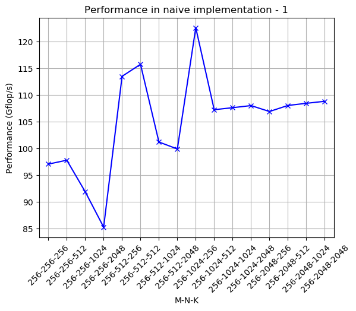

# Parallel Programming for GPUs - Matrix Multiplication

Dense Matrix Multiplication (DMM) is one of the core components in many scientific computations. In this repository, we implement the DMM algorithm for GPUs in CUDA using 4 algorithms, increasing each time the total performance. 


## Algorithms
 - __Naive:__ Simple implementation where each thread just computes one element from the output matrix. 
 - __Coalesced memory acceses of A:__ Load tiles of the input matrix A in the shared memory.
 - __Reduced memory accesses:__ Load tiles of the input matrices A and B in the shared memory.
 - __Using cuBLAS library__


## Brief results

All experiments were performed in a __NVIDIA Tesla K40c__ (kepler architecture and compute capability=3.5) 

- Total Performance in 2048×2048 matrices

 <p float="left">
  
  
</p>


- Choosing the optimal thread block size

 <p float="left">
  
  
  
</p>

- Performance in different problem sizes

 <p float="left">
  
  
  
</p>

 <p float="left">
  
  
  
</p>

 <p float="left">
  
  
  
</p>

 <p float="left">
  
  
  
</p>


## Project Structure
 - ```cuda:``` Source code for DMM.
 - ```common:``` Helper source code.
 - ```make:``` Scripts for compiling the source code.
 - ```plots:``` Plots in order to analyze our results.
 - ```results:``` Performance of different scenarios.
 - ```report:``` Final report in Greek.

## Contributors:
- [Antoniadis Panagiotis](https://github.com/PanosAntoniadis)
- [Bazotis Nikolaos](https://github.com/Nick-Buzz)
